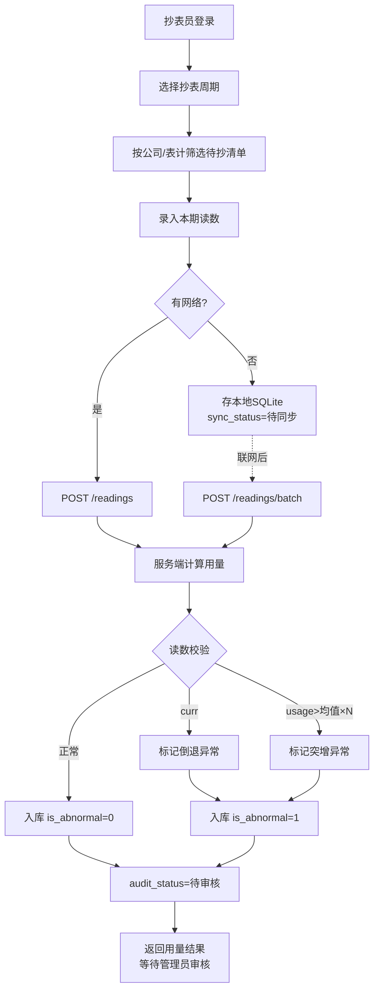
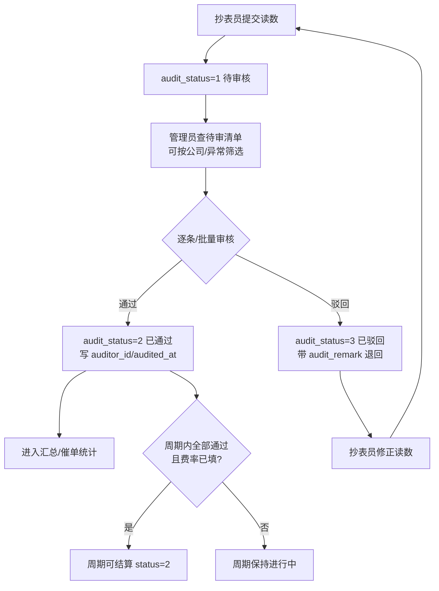
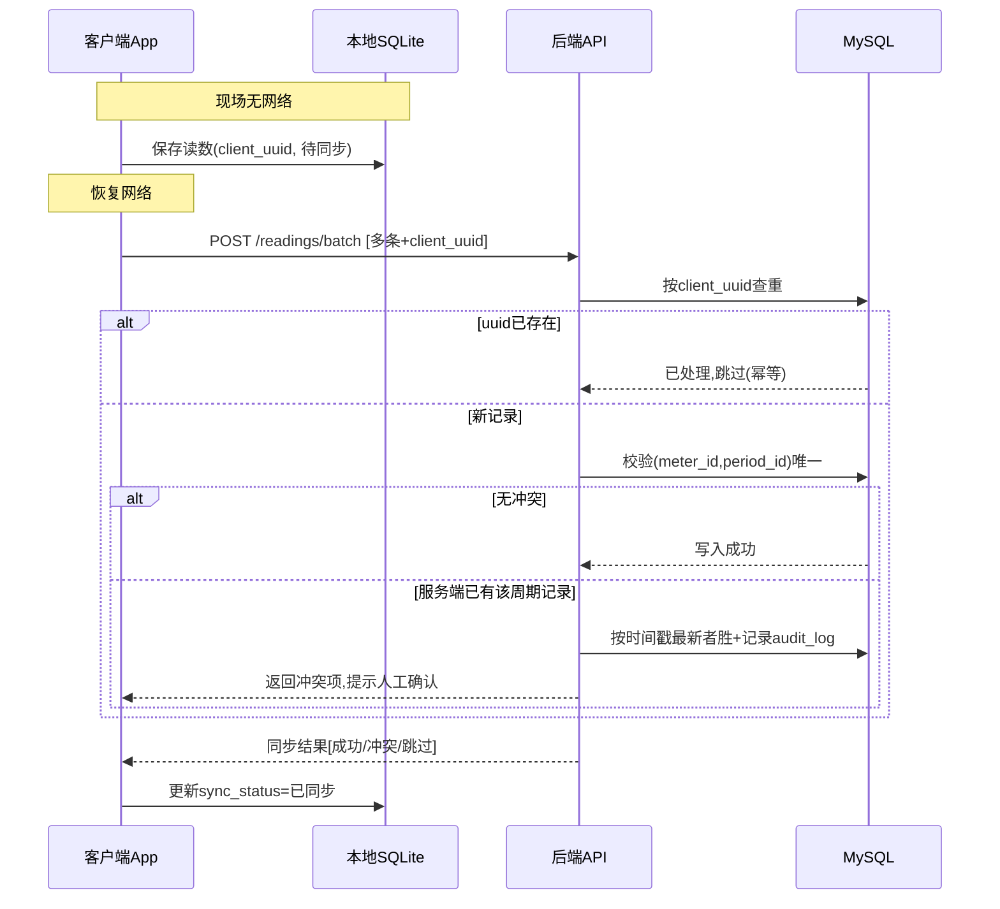
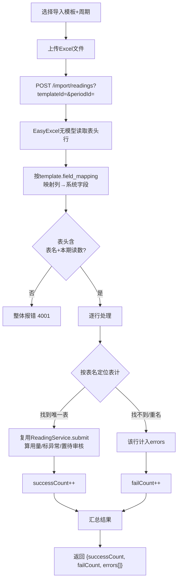
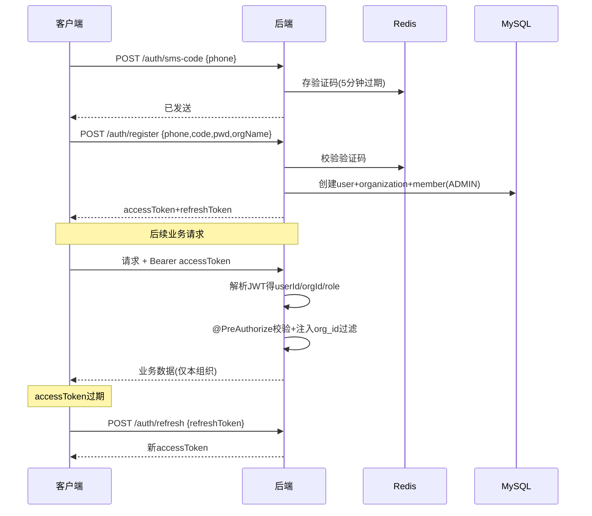

# 水电表抄表管理 App — 技术方案文档 (TRD)

| 项目 | 内容 |
|------|------|
| 文档版本 | v0.4(后端端点全实现) |
| 创建日期 | 2026-08-12 |
| 更新日期 | 2026-08-13 |
| 关联文档 | [PRD.md](./PRD.md) · [注册流程说明.md](./注册流程说明.md) |
| 客户端 | iOS 原生 (Swift/SwiftUI) + Android 原生 (Kotlin/Jetpack Compose) |
| 后端 | Java 17 + Spring Boot 3.x |
| 数据库 | MySQL 8.x + Redis(缓存/会话) |
| 状态 | 后端全部端点已实现并对齐(接口/字段以代码为准);移动端待开工 |

---

## 1. 技术选型

| 层 | 选型 | 理由 |
|----|------|------|
| iOS | Swift + SwiftUI | 原生体验,现场抄表交互流畅;SwiftUI 表单/列表开发效率高 |
| Android | Kotlin + Jetpack Compose | 官方推荐现代技术栈,声明式 UI |
| 本地存储(端) | SQLite (iOS: GRDB / Android: Room) | 支撑离线抄表暂存与同步 |
| 后端框架 | Spring Boot 3.x + Spring Security | 生态成熟,权限/事务/校验完善 |
| 数据库 | MySQL 8.x | 关系型,适合台账、周期、读数的强一致场景 |
| 缓存 | Redis | 会话 Token、汇总结果缓存、验证码 |
| 对象存储 | S3 兼容(MinIO / 云 OSS) | 存抄表照片 |
| Excel 处理 | Apache POI / EasyExcel | 导入导出;EasyExcel 内存占用低,适合大表 |
| 图表 | 客户端本地绘制(iOS Swift Charts / Android MPAndroidChart) | 汇总图表在端侧渲染,后端只出聚合数据 |
| 鉴权 | JWT (Access + Refresh Token) | 无状态、多端友好 |
| API 风格 | RESTful + JSON | 通用、易调试 |

---

## 2. 系统架构

### 2.1 总体架构
```
┌─────────────┐     ┌─────────────┐
│  iOS App    │     │ Android App │   ← 原生双端,本地 SQLite 离线缓存
│ (SwiftUI)   │     │  (Compose)  │
└──────┬──────┘     └──────┬──────┘
       │      HTTPS / JWT   │
       └─────────┬──────────┘
                 ▼
        ┌─────────────────┐
        │   API 网关 / LB  │   (Nginx)
        └────────┬────────┘
                 ▼
     ┌───────────────────────────┐
     │   Spring Boot 应用层        │
     │  ┌──────────────────────┐ │
     │  │ Auth  台账  抄表  报表 │ │  ← 模块化单体
     │  │ 导入   催单  成员权限   │ │
     │  └──────────────────────┘ │
     └───┬─────────┬─────────┬───┘
         ▼         ▼         ▼
     ┌──────┐  ┌──────┐  ┌────────┐
     │MySQL │  │Redis │  │对象存储 │
     └──────┘  └──────┘  └────────┘
```

### 2.2 后端模块划分(模块化单体)
| 包(模块) | 职责 | 状态 |
|------|------|------|
| `auth` | 注册、登录、JWT、`/me` | ✅(验证码/邀请待接) |
| `org` | 组织、成员、角色变更 (RBAC) | ✅ |
| `ledger` | 公司管理、表计台账 CRUD | ✅ |
| `reader` | 抄表员↔公司分配、READER 数据范围解析 | ✅ |
| `reading` | 抄表周期、读数录入、用量计算、异常校验、审核、结算 | ✅ |
| `report` | 用量汇总、按公司催缴归集、图表(趋势/占比/电水对比) | ✅ |
| `dataimport` | 可配置模板的 Excel 读数导入、样例下载 | ✅(台账批量导入待实现) |
| `audit` | 审计日志(审核/覆盖/分配/改角色) | ✅ |
| `common` | 统一响应、异常、错误码、健康检查 | ✅ |
| `sync` | 离线批量同步与冲突处理 | 规划(当前逐条 POST + 最新覆盖) |

> 包名说明:导入实现为 `dataimport`(`import` 是 Java 关键字不能作包名);催缴归并入 `report`;离线同步暂未独立成 `sync` 包,靠 `reading.submit` 的幂等+最新覆盖支撑。
> 采用模块化单体:初期部署运维简单,模块边界清晰,后续可按需拆微服务。

---

## 3. 数据模型设计

### 3.1 ER 关系
```
organization 1───N member (user 关联, 带 role)
organization 1───N company
organization 1───N meter
organization 1───N period
company      1───N meter
company      N───N member (reader_company: 抄表员←→公司 分配)
meter        1───N reading
period       1───N reading
reading      N───1 member (auditor: 审核人)
import_template N──1 organization
audit_log    N──1 organization
```

### 3.2 核心表结构

**organization(组织)**
| 字段 | 类型 | 说明 |
|------|------|------|
| id | BIGINT PK | |
| name | VARCHAR(100) | 组织名称 |
| contact / phone | VARCHAR | 联系人/电话 |
| created_at / updated_at | DATETIME | |

**user(用户)**
| 字段 | 类型 | 说明 |
|------|------|------|
| id | BIGINT PK | |
| phone | VARCHAR(20) | 手机号,登录标识,唯一 |
| email | VARCHAR(100) | 可选 |
| password_hash | VARCHAR(100) | BCrypt |
| nickname | VARCHAR(50) | |
| status | TINYINT | 启用/禁用 |

**member(组织成员 — 用户在组织中的角色)**
| 字段 | 类型 | 说明 |
|------|------|------|
| id | BIGINT PK | |
| org_id | BIGINT FK | |
| user_id | BIGINT FK | |
| role | VARCHAR(20) | ADMIN / READER / VIEWER |
| status | TINYINT | 邀请中/已加入/停用 |
| 唯一键 | (org_id, user_id) | 一人在一组织仅一条 |

**company(公司/租户)**
| 字段 | 类型 | 说明 |
|------|------|------|
| id | BIGINT PK | |
| org_id | BIGINT FK | |
| name | VARCHAR(100) | 公司名称 |
| contact / phone | VARCHAR | 联系人/电话(催缴用) |
| remark | VARCHAR(255) | 备注 |

**meter(表计)**
| 字段 | 类型 | 说明 |
|------|------|------|
| id | BIGINT PK | |
| org_id | BIGINT FK | |
| company_id | BIGINT FK | 所属公司 |
| name | VARCHAR(100) | 表名/编号 |
| type | TINYINT | 1=电表 2=水表 |
| initial_reading | DECIMAL(14,3) | 初始底数 |
| ratio | DECIMAL(10,3) | 倍率,默认 1 |
| location | VARCHAR(100) | 安装位置 |
| status | TINYINT | 启用/停用 |

**period(抄表周期)**
| 字段 | 类型 | 说明 |
|------|------|------|
| id | BIGINT PK | |
| org_id | BIGINT FK | |
| name | VARCHAR(50) | 如 2026-08 |
| start_date / end_date | DATE | 起止(用户自定义,不自动按自然月) |
| elec_price | DECIMAL(10,4) | 本周期电价(元/度),可空;空则费用列显示「未定价」 |
| water_price | DECIMAL(10,4) | 本周期水价(元/吨),可空 |
| status | TINYINT | 1=进行中 2=已结算 |

**reading(抄表记录)**
| 字段 | 类型 | 说明 |
|------|------|------|
| id | BIGINT PK | |
| org_id | BIGINT FK | |
| meter_id | BIGINT FK | |
| period_id | BIGINT FK | |
| company_id | BIGINT | 冗余自 meter,避免报表 join(写入时带入) |
| type | TINYINT | 冗余自 meter:1=电表 2=水表(报表按类型分组) |
| prev_reading | DECIMAL(14,3) | 上期读数 |
| curr_reading | DECIMAL(14,3) | 本期读数 |
| usage_amount | DECIMAL(14,3) | 用量 = (curr-prev)*ratio;倒退时记 0 |
| photo_url | VARCHAR(255) | 照片 |
| reader_id | BIGINT | 抄表人 |
| read_at | DATETIME | 抄表时间 |
| is_abnormal | TINYINT | 是否异常(倒退/超均值) |
| abnormal_type | VARCHAR(20) | BACKWARD/SPIKE/null |
| audit_status | TINYINT | 1=待审核 2=已通过 3=已驳回 |
| auditor_id | BIGINT | 审核人(member.id),驳回/通过时写入 |
| audited_at | DATETIME | 审核时间 |
| audit_remark | VARCHAR(255) | 审核意见(驳回原因) |
| client_uuid | VARCHAR(64) | 离线幂等键,唯一 |
| remark | VARCHAR(255) | |
| 唯一键 | (meter_id, period_id) | 一表一周期一条 |

**reader_company(抄表员←→公司 分配)**
| 字段 | 类型 | 说明 |
|------|------|------|
| id | BIGINT PK | |
| org_id | BIGINT FK | |
| member_id | BIGINT FK | 抄表员(member.id) |
| company_id | BIGINT FK | 分配到的公司 |
| 唯一键 | (member_id, company_id) | 同一抄表员对同一公司仅一条 |

> 抄表员(role=READER)只能看/写其被分配公司下的表计;管理员(ADMIN)无需分配、可见全组织。

**import_template(可配置导入模板)**
| 字段 | 类型 | 说明 |
|------|------|------|
| id | BIGINT PK | |
| org_id | BIGINT FK | |
| name | VARCHAR(50) | 模板名 |
| field_mapping | JSON | Excel 列名 → 系统字段 的映射,如 `{"表名":"meterName","本期读数":"currReading"}`;系统字段值域:meterName / currReading / photoUrl / remark |
| is_default | TINYINT | 是否默认模板(预留,当前经 API 现建) |

**audit_log(审计日志)**
| 字段 | 类型 | 说明 |
|------|------|------|
| id / org_id / user_id | BIGINT | |
| action | VARCHAR(50) | 操作类型:READING_AUDIT(审核) / READING_OVERWRITE(覆盖) / READER_ASSIGN(分配) / MEMBER_ROLE_CHANGE(改角色) |
| target | VARCHAR(100) | 操作对象 |
| detail | JSON | 变更前后 |
| created_at | DATETIME | |

> 所有业务表带 `org_id`,查询强制带组织维度,保证多组织数据隔离。

### 3.3 索引设计
| 表 | 索引 | 用途 |
|----|------|------|
| user | UNIQUE(`phone`) | 登录查账号 |
| member | UNIQUE(`org_id`,`user_id`);IDX(`user_id`) | 成员去重;反查用户所属组织 |
| company | IDX(`org_id`,`name`) | 组织内按名查公司 |
| meter | IDX(`org_id`,`company_id`);IDX(`org_id`,`type`,`status`) | 按公司/类型/状态筛选台账 |
| period | IDX(`org_id`,`status`) | 查进行中周期 |
| reading | UNIQUE(`meter_id`,`period_id`);UNIQUE(`org_id`,`client_uuid`);IDX(`org_id`,`period_id`,`audit_status`);IDX(`org_id`,`period_id`,`company_id`,`type`) | 防重复抄表;离线幂等;按审核态查;汇总加速 |
| reader_company | UNIQUE(`member_id`,`company_id`);IDX(`org_id`,`company_id`) | 抄表员分配去重;反查公司的抄表员 |
| audit_log | IDX(`org_id`,`created_at`) | 按时间查操作记录 |

> **优化点(已落地)**:`reading` 已冗余 `company_id` 与 `type`,报表汇总直接按 `(period_id, company_id, type)` 分组,免 join `meter`;写入读数时从 meter 一次性带入,后续 meter 归属变更不回溯历史读数(账单以抄表当时归属为准)。
> **幂等**:`client_uuid` 加唯一索引,离线批量重传时靠数据库唯一约束兜底去重。

### 3.4 数据量估算与容量规划
| 维度 | 估算 | 说明 |
|------|------|------|
| 单组织表计数 | ≤ 5000 | PRD 性能目标上限 |
| 抄表记录增量 | 5000 条/月/组织 | 每表每周期一条 |
| 10 年累计(单组织) | ~60 万条 | 远低于 MySQL 单表千万级瓶颈 |
| 100 组织规模 | reading ~6000 万条/10 年 | 单实例可承载,必要时按 `org_id` 分表 |
| 照片存储 | 每张 200KB~1MB | **不入库**,走对象存储,库中只存 URL |

> 结论:初期单库单表足够,无需分库分表;照片等大对象一律走对象存储,数据库只保留结构化数据与索引。

---

## 4. 关键接口设计(REST)

> 统一前缀 `/api/v1`,统一响应体 `{ code, message, data }`,鉴权走 `Authorization: Bearer <token>`。

### 4.1 认证与成员
| 方法 | 路径 | 说明 | 状态 |
|------|------|------|------|
| POST | `/auth/register` | 注册并创建组织(管理员) | ✅ |
| POST | `/auth/login` | 登录,返回 access/refresh token | ✅ |
| POST | `/auth/refresh` | 刷新 token | ✅ |
| GET | `/auth/me` | 当前登录用户(验证 JWT) | ✅ |
| POST | `/auth/sms-code` | 获取验证码 | 待实现(注册暂放开验证码校验) |
| GET | `/members` | 成员列表(管理员) | ✅ |
| PATCH | `/members/{id}/role` | 调整成员角色(管理员,写审计;不能改自己) | ✅ |
| POST | `/members/invite` | 管理员邀请成员(生成邀请码/链接) | 待实现 |
| POST | `/members/join` | 凭邀请码加入组织 | 待实现 |

### 4.2 台账
| 方法 | 路径 | 说明 | 状态 |
|------|------|------|------|
| GET/POST | `/companies` | 公司列表 / 新增 | ✅ |
| PUT/DELETE | `/companies/{id}` | 编辑 / 删除(有表计挂靠时禁止删除) | ✅ |
| GET/POST | `/meters` | 表计列表(支持按公司/类型/状态筛选)/ 新增 | ✅ |
| PUT/DELETE | `/meters/{id}` | 编辑 / 删除 | ✅ |
| GET/POST | `/readers/{memberId}/companies` | 查询 / 设置抄表员的公司分配(全量覆盖,仅 ADMIN) | ✅ |

### 4.3 导入导出
| 方法 | 路径 | 说明 | 状态 |
|------|------|------|------|
| GET/POST | `/import/templates` | 模板列表 / 新建模板(配置字段映射,仅 ADMIN) | ✅ |
| POST | `/import/readings?templateId=&periodId=` | 上传 Excel 按模板导入读数,返回成功/失败行数与错误明细(ADMIN/READER) | ✅ |
| GET | `/import/templates/{id}/sample` | 下载该模板的样例 Excel | 待实现 |
| GET | `/export/meters` · `/export/readings` | 导出台账 / 抄表记录 | 待实现 |

> 导入按**表名**在组织内定位表计(重名该行报错),逐行复用读数提交逻辑(自动幂等、算用量、标异常、置待审核、READER 公司范围校验)。当前为「解析即提交」,校验与确认合并为一步;若后续需要「先校验预览、再确认」两段式,再拆 `confirm` 接口。

### 4.4 抄表
| 方法 | 路径 | 说明 | 状态 |
|------|------|------|------|
| GET/POST | `/periods` | 周期列表 / 新建周期(可带 elecPrice/waterPrice) | ✅ |
| PUT | `/periods/{id}` | 编辑周期(补/改费率、起止日期) | ✅ |
| POST | `/periods/{id}/settle` | 标记结算(校验:读数全部审核通过 + 已填对应费率;空周期可结算) | ✅ |
| GET | `/readings?periodId=&auditStatus=&companyId=` | 读数列表(READER 仅见分配公司;auditStatus/companyId 可选筛选) | ✅ |
| POST | `/readings` | 提交单条读数(返回计算用量+异常标记;auditStatus=待审核;同表同周期最新覆盖) | ✅ |
| GET | `/periods/{id}/tasks` | 某周期待抄清单(抄表员仅见分配公司) | 待实现(可用 `/readings?periodId=` 近似替代) |
| POST | `/readings/batch` | 批量提交(离线同步用) | 待实现(离线批量当前逐条 POST) |
| PUT | `/readings/{id}` | 修正读数 | 待实现(重复 POST 同表同周期即最新覆盖) |

### 4.4.1 审核(管理员)
| 方法 | 路径 | 说明 | 状态 |
|------|------|------|------|
| GET | `/readings?periodId=&auditStatus=1` | 待审核清单(支持按公司筛选) | ✅ |
| POST | `/readings/{id}/audit` | 单条审核,body `{approved:bool, remark}`;驳回原因写入 auditRemark | ✅ |
| POST | `/readings/audit/batch` | 批量审核,body `{ids:[...], approved:bool, remark}`;越权/他组织 id 静默忽略 | ✅ |

> 审核为管理员专属(`@PreAuthorize("hasRole('ADMIN')")`)。通过/驳回都会写 `auditor_id`/`audited_at` 与审计日志;驳回退回抄表员,可修正后重新提交(回到待审核)。

### 4.5 催单与报表
| 方法 | 路径 | 说明 | 状态 |
|------|------|------|------|
| GET | `/reports/summary?periodId=` | 各公司各类型用量/费用汇总(仅计 audit_status=2,带 pendingCount) | ✅ |
| GET | `/dunning/{periodId}` | 按公司归集的催缴数据(电费+水费+合计,仅计已通过) | ✅ |
| GET | `/dunning/{periodId}/company/{companyId}/export` | 导出某公司催缴单 | 待实现 |
| GET | `/reports/charts?type=trend\|ratio&companyId=` | 图表聚合数据 | 待实现 |

> **访问权限**:报表/催单是账单口径,仅 ADMIN/VIEWER 可访问(不叠加 READER 公司范围)。
> **审核门槛**:催单与汇总均只统计 `audit_status=2`(已通过)的读数,未审/驳回不进账单;接口在 `data.pendingCount` 返回该周期待审数量以提示管理员。费率未填时该类型 `fee` 返回 `null`(未定价)。

### 4.6 核心接口字段与示例

**POST `/auth/register`** — 注册并创建组织
```jsonc
// Request
{
  "phone": "13800138000",
  "smsCode": "123456",
  "password": "abc12345",
  "orgName": "XX产业园"
}
// Response
{
  "code": 0, "message": "ok",
  "data": {
    "userId": 1001, "orgId": 2001, "role": "ADMIN",
    "accessToken": "eyJ...", "refreshToken": "eyJ...", "expiresIn": 7200
  }
}
```

**POST `/readings`** — 提交单条读数
```jsonc
// Request
{
  "meterId": 3001,
  "periodId": 4001,
  "currReading": 1250.5,
  "photoUrl": "https://oss/xxx.jpg",
  "clientUuid": "a1b2-c3d4",   // 幂等键,离线生成
  "remark": ""
}
// Response
{
  "code": 0, "message": "ok",
  "data": {
    "id": 5001,
    "meterId": 3001,
    "periodId": 4001,
    "prevReading": 1200.0,
    "currReading": 1250.5,
    "usageAmount": 50.5,       // 服务端计算 =(本期-上期)×倍率
    "isAbnormal": false,
    "abnormalType": null,      // BACKWARD(倒退) / SPIKE(突增) / null
    "auditStatus": 1,          // 提交后置待审核,管理员通过才进账单
    "auditRemark": null        // 审核意见/驳回原因
  }
}
```

**POST `/readings/{id}/audit`** — 审核通过或驳回(管理员)
```jsonc
// Request(驳回示例;approved=true 则为通过,remark 可省)
{ "approved": false, "remark": "照片模糊,读数看不清,请重拍" }
// Response —— 返回完整读数记录
{
  "code": 0, "message": "ok",
  "data": {
    "id": 5001,
    "meterId": 3001,
    "periodId": 4001,
    "prevReading": 1200.0,
    "currReading": 1250.5,
    "usageAmount": 50.5,
    "isAbnormal": false,
    "abnormalType": null,
    "auditStatus": 3,          // 2=已通过 / 3=已驳回(退回抄表员可修正重提)
    "auditRemark": "照片模糊,读数看不清,请重拍"
  }
}
```

**POST `/readings/audit/batch`** — 批量审核(管理员)
```jsonc
// Request
{ "ids": [5001, 5002, 5003], "approved": true, "remark": "" }
// Response —— 成功处理的条数(越权/他组织 id 静默忽略)
{ "code": 0, "message": "ok", "data": { "processed": 3 } }
```

**POST `/import/readings?templateId=7001&periodId=4001`** — 按模板导入(multipart: file)
```jsonc
// Response —— 逐行解析并提交,返回成功/失败统计与错误明细
{
  "code": 0, "message": "ok",
  "data": {
    "successCount": 96,
    "failCount": 4,
    "errors": [
      "第12行: 找不到表计: 3号楼总表",
      "第34行: 读数不是数字: 抄见1250"
    ]
  }
}
```

**GET `/reports/summary?periodId=4001`** — 各公司各类型用量/费用汇总
```jsonc
// Response —— rows 按 (companyId, type) 分组;仅计已通过读数
{
  "code": 0, "message": "ok",
  "data": {
    "periodId": 4001,
    "pendingCount": 2,         // 该周期仍有 2 条待审,提示管理员
    "rows": [
      {"companyId": 6001, "type": 1, "usage": 3200.0, "fee": 1920.00},
      {"companyId": 6001, "type": 2, "usage": 120.5, "fee": null},   // 水价未填→未定价
      {"companyId": 6002, "type": 1, "usage": 1500.0, "fee": 900.00}
    ]
  }
}
```

**GET `/dunning/4001`** — 按公司归集的催缴数据
```jsonc
// Response —— 每公司电费+水费+合计(仅计已通过;未定价项为 null,合计只累加已定价部分)
{
  "code": 0, "message": "ok",
  "data": {
    "periodId": 4001,
    "pendingCount": 0,
    "rows": [
      {"companyId": 6001, "elecUsage": 3200.0, "elecFee": 1920.00,
       "waterUsage": 120.5, "waterFee": 361.50, "totalFee": 2281.50},
      {"companyId": 6002, "elecUsage": 1500.0, "elecFee": 900.00,
       "waterUsage": 80.0, "waterFee": 240.00, "totalFee": 1140.00}
    ]
  }
}
```

---

## 5. 关键技术方案

### 5.1 可配置 Excel 导入(FR-2 核心难点)
**问题**:不同来源 Excel 表头列名不一致,不能写死。

**当前已落地(读数导入)**:
1. `import_template.field_mapping` 存扁平 JSON:`Excel列名 → 系统字段`,系统字段值域 meterName / currReading / photoUrl / remark。示例:
   ```json
   { "表名": "meterName", "本期读数": "currReading" }
   ```
2. `POST /import/readings?templateId=&periodId=` 上传 Excel:EasyExcel 无模型读表头 → 按 `field_mapping` 定位列 → 逐行按**表名**在组织内定位表计(重名该行报错)→ 复用 `ReadingService.submit`(自动幂等、算用量、标异常、置待审核、READER 公司范围校验);
3. 返回 `{ successCount, failCount, errors: ["第N行: 原因"] }`,前端展示失败明细;
4. 校验必须映射 meterName + currReading,缺列或读数非数字该行计入 errors。

**规划中(台账导入,尚未实现)**:表计台账批量导入(表名/所属单位/类型枚举/起始底数),需要「先校验预览、错误行高亮、再确认导入、公司可自动创建」的两段式流程,field_mapping 届时扩展为带 required/enumMap 的结构:
   ```json
   {
     "columns": [
       {"excelHeader": "表名称", "systemField": "name", "required": true},
       {"excelHeader": "类型", "systemField": "type", "enumMap": {"电": 1, "水": 2}}
     ]
   }
   ```

> 默认模板字段集**待用户提供实际模板后补全**,当前机制保持字段映射可配置、不写死。

### 5.2 离线抄表与同步(非功能核心)
**场景**:现场无网,读数先存本地,联网后同步。

**方案**:
- 端侧 SQLite 存 `local_reading`,带 `sync_status`(待同步/已同步)与 `client_uuid`(客户端生成的幂等 ID);
- 联网后上传,后端以 `client_uuid` 做幂等去重(`UNIQUE(org_id, client_uuid)` 兜底),避免重复提交;当前逐条调 `POST /readings`(批量端点 `/readings/batch` 待实现);
- **冲突处理(决策 4:最新覆盖)**:同一 `(meter_id, period_id)` 已存在服务端记录时,采用「**服务端时间戳最新者胜**」——后到的读数覆盖旧值,旧值变更快照写入 `audit_log` 以便追溯;覆盖后该记录 `audit_status` 重置为待审核。

### 5.3 用量计算与异常校验
- 提交读数时后端计算 `usage = (curr - prev) * ratio`;
- `prev` 取该表上一周期 `curr`(仅取 `audit_status=2 已通过` 的上期读数,避免拿未审数据当基准),首期取 `initial_reading`;
- 异常规则:①`curr < prev` → 标记「读数倒退」abnormal_type=BACKWARD;②`usage > 该表历史均值 × N`(N 可配置,默认 3)→ 标记「用量突增」SPIKE;
- 异常记录 `is_abnormal=1` 但仍入库,进入待审核流程由管理员人工确认,不阻断抄表。

### 5.4 权限控制 (RBAC)
- Spring Security 方法级安全:`@EnableMethodSecurity` + `@PreAuthorize("hasRole('ADMIN')")` / `hasAnyRole('ADMIN','READER')` 注解在 Controller 方法上;
- 请求携带 JWT,`JwtAuthFilter` 解析出 `userId + orgId + role` 放入 SecurityContext,`CurrentUser` 静态取用;
- 数据层统一按 `org_id` 过滤(service 层用 `CurrentUser.orgId()` + JPA Specification / 派生查询),防止越权访问他组织数据;
- **抄表员按公司分配(决策 5)**:role=READER 的成员,数据范围由 `reader_company` 决定,由 `ReaderScopeService` 统一解析:提交读数时 `assertCanSubmitForCompany` 校验,读数列表用 `companyScopeSpec()` 追加 `company_id IN (分配的公司)`;ADMIN/VIEWER 不限制(可见全组织)。
  - 解析路径:JWT 只有 userId,而 `reader_company.member_id` 指向 member.id,故需 `userId+orgId → Member → member.id → reader_company`。
- **审核为管理员专属**:`/readings/{id}/audit` 与 `/readings/audit/batch` 用 `@PreAuthorize("hasRole('ADMIN')")` 拦截,抄表员无审核权。

### 5.5 报表聚合
- 汇总接口按 `period_id + org_id` 聚合 `reading.usage_amount`,**仅计 `audit_status=2`**,按 `company_id + type` 分组求和(JPQL `GROUP BY`,直接用 reading 冗余字段,免 join meter);
- 费用 = 用量 × 当期费率(见 5.7),金额 `setScale(2, HALF_UP)`;费率未填该类型 `fee` 返回 `null`;
- `summary` 返回按 (companyId, type) 分组的行 + `pendingCount`;`dunning` 在其上按公司归集电费/水费/合计;
- 当前为实时聚合查询(数据量小,足够);后续量大时再按 `(periodId, orgId)` 加 Redis 缓存,并在台账/读数/审核状态/费率变更时失效(**缓存尚未实现**);
- 图表数据(`/reports/charts`)由后端出聚合 JSON、客户端本地绘制(Swift Charts / MPAndroidChart)——**待实现**。

### 5.6 审核流转(决策 3)
**规则**:抄表员提交 → 管理员确认才生效,只有已通过的读数进入汇总与催单。

**状态机**:
```
待审核(1) ──管理员通过──▶ 已通过(2) ──周期全通过+已填费率──▶ 周期可结算
     │
     └──管理员驳回(带原因)──▶ 已驳回(3) ──抄表员修正重提──▶ 待审核(1)
```
- 提交/离线同步/覆盖后的读数一律置 `audit_status=1`;
- 通过/驳回写 `auditor_id + audited_at`,驳回原因写 `audit_remark`(可选,建议驳回时填);驳回记录退回抄表员,可编辑后重新提交(回到待审核);
- 支持批量审核 `POST /readings/audit/batch`(body `{ids, approved, remark}`),便于「一个 Excel 全部通过」的小规模场景一键过审;
- 审核动作写 `audit_log`(action=READING_AUDIT,记通过/驳回、前后状态、意见)。

### 5.7 费用计算(决策 1)
- 费率**按周期手动输入**,每月可不同,存 `period.elec_price / water_price`,不做全局费率表;
- `fee = usage × (该 reading 所属 period 的对应类型单价)`:电表用 `elec_price`,水表用 `water_price`;
- 金额一律用 `DECIMAL`/`BigDecimal` 计算(`setScale(2, HALF_UP)`),避免浮点误差;
- 周期未填对应费率时,该类型 `fee` 返回 `null`(未定价),且**周期不可结算**;
- 结算校验(`POST /periods/{id}/settle`):① 周期内读数全部 `audit_status=2`;② 有电表读数则电价已填、有水表读数则水价已填 → 满足才置 `period.status=2 已结算`;空周期(无读数)允许结算。不满足抛错误码 4003。

---

## 6. 核心流程图

### 6.1 抄表主流程


### 6.2 审核流转(抄表员提交 → 管理员确认)


### 6.3 离线抄表同步时序


### 6.4 可配置 Excel 导入流程(读数导入,已实现)


> 注:上表为已落地的**读数导入**(表名→读数,一段式:解析即提交)。**台账导入**(表计批量建档、类型枚举、公司自动创建、两段式校验-确认)尚未实现,见 §5.1 规划部分。

### 6.5 注册登录与鉴权时序


---

## 7. 非功能性设计

| 类别 | 方案 |
|------|------|
| 性能 | 列表分页;汇总走 Redis 缓存;5000 表计内响应 < 2s |
| 安全 | 密码 BCrypt;JWT 短时效 + Refresh;org_id 强隔离;操作审计 audit_log |
| 离线 | 端侧 SQLite + 幂等批量同步 |
| 数据一致 | (meter_id, period_id) 唯一约束;用量计算在服务端;金额计算用 DECIMAL |
| 可观测 | 统一日志 + 崩溃/性能监控;关键操作埋点 |
| 兼容 | iOS 14+ / Android 10+ |

### 7.1 统一错误码
> 响应体 `{ code, message, data }`,`code=0` 为成功,非 0 为业务/系统错误。

| code | 含义 | HTTP |
|------|------|------|
| 0 | 成功 | 200 |
| 1001 | 参数校验失败 | 400 |
| 1002 | 验证码错误/过期 | 400 |
| 2001 | 未登录/Token 无效 | 401 |
| 2002 | Token 过期(需 refresh) | 401 |
| 2003 | 无权限(角色不足) | 403 |
| 2004 | 越权访问他组织数据 | 403 |
| 3001 | 资源不存在 | 404 |
| 3002 | 唯一约束冲突(如表计+周期重复) | 409 |
| 4001 | 导入模板解析失败 | 422 |
| 4002 | 读数校验异常(需确认) | 200(带标记) |
| 4003 | 周期不可结算(存在待审读数或费率未填) | 409 |
| 5000 | 服务器内部错误 | 500 |

### 7.2 安全细化
| 项 | 方案 |
|----|------|
| 密码存储 | BCrypt(cost=10),不可逆 |
| Access Token | JWT,有效期 2h,载荷含 userId/orgId/role |
| Refresh Token | 有效期 7d,存 Redis,可主动吊销;刷新时轮换 |
| 防重放 | 关键写接口(读数提交)用 `clientUuid` 幂等;敏感操作校验时间戳 |
| 越权防护 | 数据层强制注入 `org_id`;`@PreAuthorize` 方法级注解校验角色;READER 再叠加 `reader_company` 公司范围 |
| 传输安全 | 全站 HTTPS;证书 pinning(可选,端侧) |
| 验证码防刷 | 同手机号 60s 一次、单日上限;图形验证码兜底 |
| 审计 | 读数修改/审核(通过·驳回)、成员/角色变更、抄表员公司分配、导入等写 `audit_log` |

---

## 8. 部署与环境

```
客户端 → CDN/HTTPS → Nginx(LB) → Spring Boot(可多实例)
                                    ├── MySQL(主从可选)
                                    ├── Redis
                                    └── 对象存储(照片)
```
- 环境分离:dev / test / prod;
- CI/CD:后端 Docker 镜像化部署;客户端走 TestFlight / 蒲公英内测,再上架(详见《发布与下载流程.md》)。

### 8.1 数据库选型:省钱优先,按阶段升级

**结论:起步阶段(自己用/少数人用)用「一台轻量云服务器 + 自建 MySQL」,不开 RDS。等用户变多、数据变重要了再迁到云数据库。**

分阶段策略:

| 阶段 | 用户量 | 方案 | 月成本 |
|------|--------|------|--------|
| **① 起步(现在)** | 自己 / 几个人 | 一台轻量应用服务器,后端+MySQL+Redis 全装在里面,照片存本地磁盘 | **~¥30-70/月** |
| **② 成长** | 几十~上百人 | 服务器升配;或把 MySQL 单独拆到云数据库 RDS | ~¥150-300/月 |
| **③ 正式** | 上千人/多组织 | 云 RDS 高可用版 + 云 Redis + 对象存储 | 按量,¥300+/月 |

> 为什么起步不用 RDS:RDS 最便宜也要 ¥100+/月,单人自用时它的自动备份/高可用是浪费。自建 MySQL 装在轻量服务器里几乎不额外花钱,数据量小、维护也简单。**代价是要自己做备份、自己盯安全**——起步阶段可接受。

### 8.2 起步阶段的最省配置(推荐现在就用这个)
| 项 | 建议 | 说明 |
|----|------|------|
| 服务器 | 云厂商「**轻量应用服务器**」2核2G / 3-4M带宽 / 50G SSD | 阿里云/腾讯云常有新用户首年 ¥30-99/年 的活动价 |
| 部署方式 | Docker Compose 一键拉起 后端 + MySQL8 + Redis | 一台机器全搞定,不用多台 |
| 照片存储 | 先存服务器本地磁盘的 `/data/uploads` | 省下对象存储费用;量大了再迁 OSS |
| MySQL | 容器版 MySQL 8.0,数据挂载到磁盘目录 | 免费 |
| Redis | 容器版 Redis,或起步先用内存缓存,连 Redis 都可省 | 免费 |
| 备份 | 每日 `mysqldump` 定时导出 + 服务器快照 | 自己做,零额外费用 |

> 轻量应用服务器比同配置的 ECS 便宜很多,且带固定带宽、按年付,最适合个人项目起步。

### 8.3 起步阶段搭建流程
```
1. 买一台轻量应用服务器(选带宽3-4M、系统盘50G,挑首年活动价)
2. 装 Docker + Docker Compose
3. 写 docker-compose.yml:后端镜像 + mysql:8.0 + redis:7
   - MySQL 数据卷挂到 /data/mysql,照片挂到 /data/uploads
4. 配置后端 application.yml 连本机 MySQL(127.0.0.1:3306)
5. Flyway 自动初始化表结构
6. 配 Nginx + 免费 HTTPS 证书(Let's Encrypt)
```
> 全程一台机器,不涉及内网互通、白名单跨实例等复杂配置。

### 8.4 起步阶段维护要点(自建,自己兜底)
| 事项 | 做法 |
|------|------|
| 备份(最重要) | 每日 crontab 跑 `mysqldump` 导出到另一目录;定期下载到本地/网盘;开服务器快照 |
| 安全 | MySQL/Redis **只监听 127.0.0.1,绝不暴露公网**;服务器防火墙只开 80/443/SSH;SSH 用密钥 |
| 磁盘 | 留意磁盘占用(照片会涨),`df -h` 定期看;满了先清照片或扩盘 |
| 慢查询 | 开 slow_query_log,数据涨了再看要不要补索引 |
| 何时升级 | 出现:CPU/内存长期打满、磁盘不够、或用户变多怕丢数据 → 迁 8.1 的阶段② |

> ⚠️ 自建唯一的真风险是**数据丢失**——所以「每日备份 + 异地保存一份」这条一定要做,其他都能慢慢来。

---

## 9. 关键决策(已确认 2026-08-12)

| # | 问题 | 决策 | 对设计的影响 | 正文落地 |
|---|------|------|--------------|----------|
| 1 | 费率 | **按周期手动输入**,每月电价可不同 | `period` 表增 `elec_price` / `water_price`;费用 = 用量 × 当期费率,不做全局费率表 | §3.2 period、§5.7 |
| 2 | 抄表周期 | **自定义起止日期** | `period.start_date` / `end_date` 由用户填,不自动按自然月生成 | §3.2 period、§4.4 |
| 3 | 审核环节 | **需要**:抄表员提交 → 管理员确认才生效 | `reading` 增 `audit_status`(1待审核/2通过/3驳回)+ `auditor_id` + `audited_at`;报表只统计已通过记录 | §3.2 reading、§4.4.1、§5.6、§6.2 |
| 4 | 离线冲突 | **最新覆盖**(服务端时间戳最新者胜) | 同 5.2 方案,冲突写 audit_log | §5.2 |
| 5 | 抄表员数据范围 | **按公司分配**;实际数据量小(常「一个 Excel 装下全部」) | 抄表员关联到 company;初期数据规模可忽略性能顾虑 | §3.2 reader_company、§4.2、§5.4 |
| 6 | 默认导入模板字段集 | **待用户后续提供实际 Excel** | 导入机制保持字段映射可配置;拿到模板后补 `field_mapping` 默认值 | §6.4(待补默认值) |
| 7 | 云厂商 | **哪家便宜用哪家**,不锁定 | 部署方案保持厂商中立;起步用轻量服务器活动价 | §8 |

### 9.1 决策带来的设计要点
- **费用计算**:`fee = usage_amount × (该 reading 所属 period 的对应类型单价)`;电表用 `elec_price`,水表用 `water_price`。周期未填价时费用列显示「未定价」。
- **审核流转**:`待审核 →(管理员通过)→ 已通过` / `→(驳回)→ 已驳回`(可退回重填)。**汇总/催单只计入 `audit_status=2` 的记录**,避免未审数据进账单。
- **周期结算**:周期内读数全部审核完 + 已填费率 → 可标记 `status=2 已结算`。

> 6 号(默认模板字段)待用户提供 Excel 后补全,其余均已可进入模块开发。
